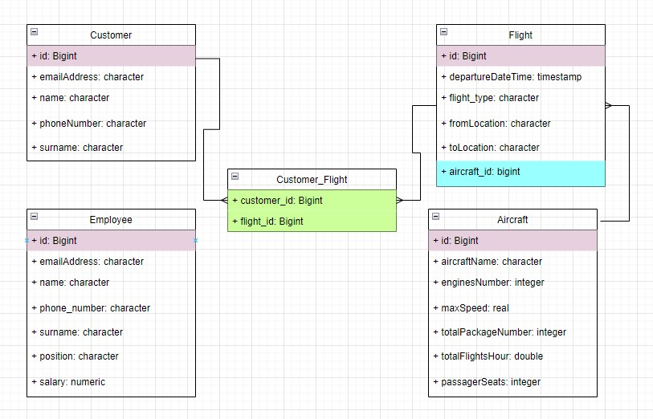
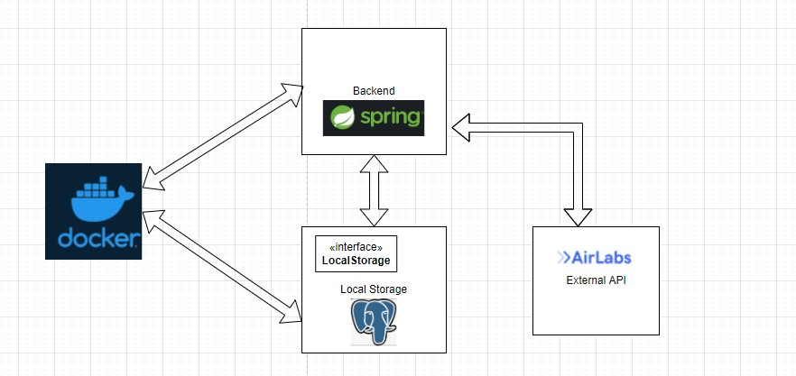
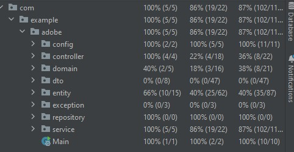

 

  

<h3 align="center">Java Springboot Project</h3>

  

    An introduction demo into Java Springboot concepts
     
    <a href="https://github.com/daniel868/JavaAdobeBootcamp"><strong>Source Code»</strong></a>
     
  

## About the project

Build as a demo application, this is an introduction into Java Springboot framework which is used for building 
real-time enterprise application.

This application simulate a very basic airline management system application, where you can store
data about the airplane, flights, customer and employees. 

### Build with

* [Springboot Java Framework]()
* [Postgresql Database]()
* [External API](https://airlabs.co/docs/flight)

### Database Schema:

    

#### Relation between tables:
1. Customer - Flight (Many-To-Many)
   1. Created using a middle table (Customer_Flight)
   2. Many customer may book the same flights and a customer may book multiple flights
2. Flight - Aircraft (Many-To-One)
   1. An aircraft could realize multiple flights, but a flight could be realized by one aircraft

## Application Architecture

    

- External API is used for fetching flights data from external source if there is no available flight into local database, 
matching client expectation 
- Java Springboot application and Local Postgresql Database are running into a docker container

## Functionality
 
### Customer:
  - Display, Insert, Delete
  - Book a flight

### Aircraft:
  - Display, Insert, Delete
  - Match an aircraft with flights

### Employee
 - Display, Insert, Delete

### Flight
 - Display, Insert, Delete
 - Match an aircraft with a flight

## Testing coverage

    

